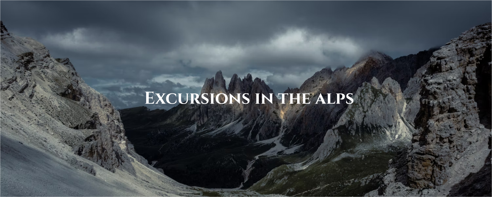

# Excursions in the Alps

## Übersicht
Dieses Projekt bietet eine Übersicht über verschiedene Ausflüge in die Alpen. Es zeigt die verfügbaren Touren, Hotels und Reisedaten an und ist darauf ausgelegt, eine angenehme Benutzererfahrung durch ansprechendes Design und gut strukturierte Inhalte zu bieten.

## Projektvorschau
Hier ist eine Vorschau auf mein Projekt:



## Key Topics

### Schriftenimport
Für dieses Projekt habe ich benutzerdefinierte Schriften importiert, um ein ansprechendes und konsistentes Erscheinungsbild zu gewährleisten. Die Schriften `Poppins` und `Cinzel` werden verwendet, um Texte und Überschriften stilvoll zu präsentieren.

```css
@font-face{
    font-family: 'Poppins', sans-serif;
    src: url("../fonts/poppins/Poppins-Regular.ttf");
}

@font-face{
    font-family: 'Cinzel', serif;
    src: url("../fonts/Cinzel/CinzelDecorative-Regular.ttf");
}
```

### Root-Variablen für Farben

Ich habe Root-Variablen verwendet, um die Farben des Projekts festzulegen. Dies macht es einfach, das Farbschema global zu verwalten und konsistente Farben im gesamten Projekt zu verwenden.

```css
:root{
    --border: #ccc;
    --color-logo: #999;
    --color-home: #fff;
    --color: #333;
}
```

## Semantisches HTML
Das HTML des Projekts ist semantisch strukturiert, um die Lesbarkeit und Zugänglichkeit zu verbessern. Semantische Elemente wie 
```html 
<header> <main> <section> <article> <footer>
``` 
werden verwendet, um den Inhalt logisch zu gliedern.

```html
<header>
    <h3>Traveller</h3>
</header>

<main>
    <section>
        <h1>Excursions in the Alps</h1>
    </section>
    <!-- Weitere Sektionen und Artikel -->
</main>

<footer>
    <h2>Contact Us</h2>
    <h3>
        <span><a href="#">Fa.</a></span>
        <span><a href="#">Tw.</a></span>
        <span><a href="#">In.</a></span>
    </h3>
</footer>
```

### Einfache Selektoren und das Box Model
Im CSS habe ich einfache Selektoren verwendet, um die Stilelemente klar und prägnant zu definieren. 
Das Box Model wird genutzt, um Abstände und Größen der Elemente zu kontrollieren.

```css
body{
    font-family: 'Poppins', sans-serif;
    font-size: 62.5%;
    margin: 0;
    padding: 0;
    box-sizing: border-box;
}

header{
    padding: 2em 8rem;
    border-bottom: 1px solid var(--border);
}
```

### Pseudo-Selektoren
Ich habe Pseudo-Selektoren verwendet, um bestimmte Stile für besondere Zustände von Elementen festzulegen, wie z.B. beim Hover-Effekt und für die Darstellung von Zustandsinformationen in Listen.

```css
li:nth-child(1)::after, li:nth-child(2)::after, li:nth-child(3)::after{
    content: "SOLD OUT";
    padding-left: 10px;
    color: red;
}

li:nth-child(4)::after{
    content: "ONLY 4 SPOT AVAILABLE";
    padding-left: 10px;
    color: red;
}

li:nth-child(5)::after, li:nth-child(6)::after{
    content: "AVAILABLE";
    padding-left: 10px;
    color: green;
}

footer a:hover{
    text-decoration: underline;
}
```

# Installation

## So installierst du das Projekt:

### 1.	Klone das Repository:
- git clone ``git@github.com:WebDev-24-02/Project-Alps.git``

### 2. Navigiere in das Projektverzeichnis:
- cd dein-projektname

### 3.	Öffne die index.html Datei in deinem Browser, um die Website zu sehen.

## Verwendung

## So verwendest du das Projekt:

	1.	Öffne die index.html Datei in deinem bevorzugten Webbrowser.
	2.	Genieße die Übersicht der verschiedenen Ausflüge in die Alpen.

## Struktur

	•	index.html: Die Haupt-HTML-Datei.
	•	assets/css/style.css: Die Haupt-CSS-Datei für die Stile.
	•	assets/images/: Ordner für Bilder, einschließlich der Projektvorschau.
